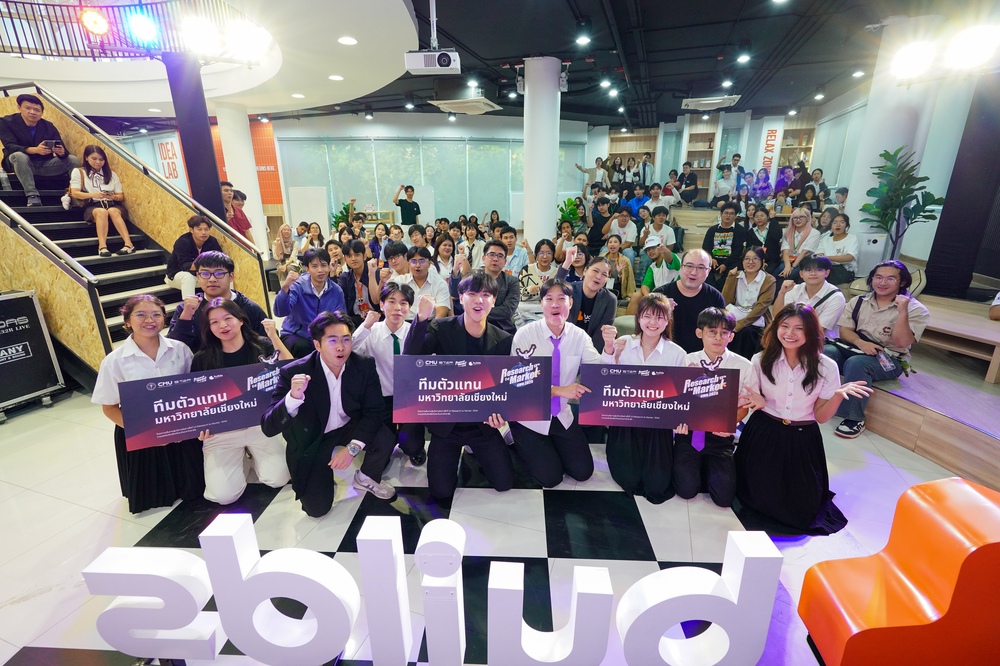

# Phankorn Seangmon (ฺBall) 👋
### 🎓 Modern Management and Information Technology (MMIT) Student
**Chiang Mai University | [cite_start]College of Arts, Media and Technology (CAMT)** [cite: 10, 11]

[cite_start]I am an MMIT student with hands-on experience in **Full-stack Web Development**, **Systems Analysis**, and **Business-oriented Technology Projects**. [cite: 6] [cite_start]I specialize in translating business requirements into structured technical solutions. [cite: 7]

---

### 🛠️ Skills & Expertise

- [cite_start]**Programming & Web:** HTML, CSS, JavaScript, TypeScript, Angular, PHP, Python [cite: 13]
- [cite_start]**Database:** MYSQL, SQL [cite: 13]
- [cite_start]**Business & Systems:** Systems Analysis & Design, Business Process Modeling (BPM), ERP Concepts [cite: 14]
- [cite_start]**Design & Tools:** GitHub, Figma, Lovable.dev, Excel (VBA), BI Tools [cite: 14]

---

### 📜 Featured Projects

#### [cite_start]🚀 [DegreeFlow](https://github.com/pkonkrurb-spec/Phankon-Portfolio.git) - Project Manager & Frontend Developer [cite: 16, 17]
- [cite_start]Led the development of a web-based academic visualization platform to replace static guidebooks with **Interactive Learning Pathways**. [cite: 19]
- [cite_start]Developed frontend components and structured user flows for Students and Admins. [cite: 22]

#### [cite_start]🔬 [R2M - Research to Market](https://github.com/pkonkrurb-spec/Phankon-Portfolio.git) - Business Developer [cite: 24, 25]
- [cite_start]Translated medical research into a viable business concept. [cite: 26]
- [cite_start]Conducted market validation, analyzed customer behavior, and developed **Business Model Canvas (BMC)**. [cite: 27, 28]

---

### 🏅 Certificates & Achievements
(รางวัลและเกียรติบัตรจากการแข่งขันและค่ายฝึกอบรมด้านธุรกิจและเทคโนโลยี) [cite_start][cite: 36]

| **Business & Innovation** | **Marketing & Startup** |
| :---: | :---: |
| [cite_start]   **IMPACT Innovative Entrepreneurship Camp** [cite: 36] |    **MyOrder Cloud Hero9** |
| [cite_start]   **CMUBS Startup Club MBS 2025** [cite: 36] | [cite_start]   **ISUZU Marketing Plan Competition** [cite: 36] |
| [cite_start]   **Singha Biz Course Regional Bootcamp** [cite: 36] | [cite_start]   **R2M Research to Market Competition**  |

---

### 🏆 Activities
ประสบการณ์นอกห้องเรียนและการทำงานเป็นทีม

| **R2M Market Validation** | **Team Collaboration** | **Baduk University Athlete** |
| :---: | :---: | :---: |
|  |  |  |
| [cite_start]การออกภาคสนามวิจัยตลาด [cite: 27] | [cite_start]การทำงานร่วมกับทีม Business [cite: 7] | [cite_start]นักกีฬากีฬาหมากล้อม (Igo)  |

---

### 📫 Connect with Me
- [cite_start]**Phone:** 093-727-0051 [cite: 2]
- [cite_start]**Email:** [pkonkrab@gmail.com](mailto:pkonkrab@gmail.com) [cite: 2]
- [cite_start]**LinkedIn:** [phankon](https://www.linkedin.com/in/phankon) [cite: 3]
- [cite_start]**GitHub:** [pkonkrurb-spec](https://github.com/pkonkrurb-spec) [cite: 4]
