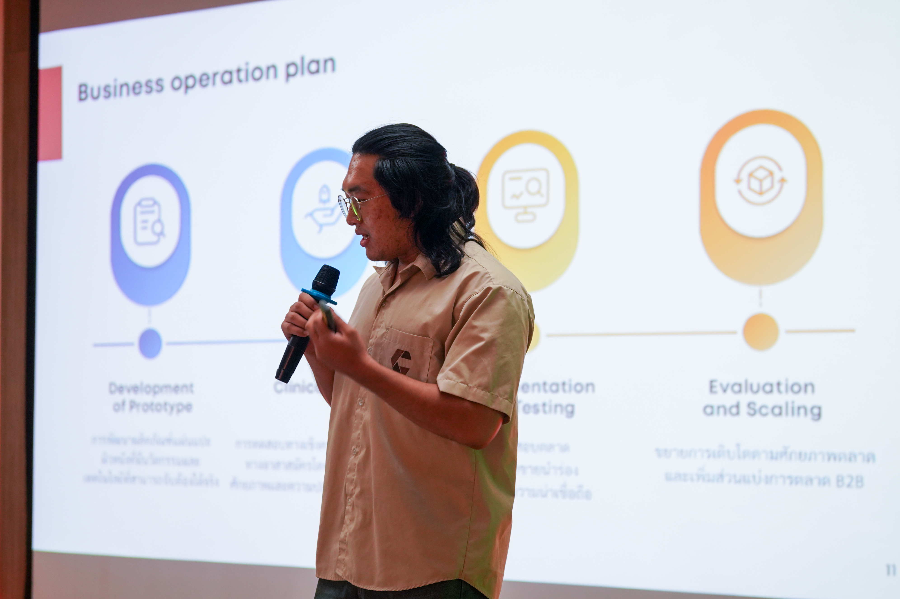

# Phankorn Seangmon (Pang) 👋
### 🎓 Junior Developer & Aspiring Business Analyst
**College of Arts, Media and Technology (CAMT), Chiang Mai University**

I bridge the gap between **Business Logic** and **Technical Solutions**.
My goal is to leverage technology to solve real-world business problems through **Full-stack Development** and **Systems Analysis**.

---

### 🛠️ Technical & Business Skills

| **Development (Dev)** | **Business & Tools (BA)** |
| :--- | :--- |
|   |   |
|   |   |
|   |   |

---

### 🚀 Featured Experience

#### 💻 DegreeFlow (Project Manager & Frontend Dev)
*A web-based academic pathway system commissioned by Digital Solution Unit, CAMT.*
- **Role:** Managed the project timeline and developed frontend components using **Angular**.
- **Impact:** Transformed static curriculum books into an interactive **Learning Pathway Dashboard**.

#### 📈 R2M - Research to Market (Business Developer)
*University-level business case competition.*
- **Role:** Analyzed market feasibility for a medical innovation (Nano Plaster).
- **Outcome:** Developed a **Business Model Canvas (BMC)** and validated the market size (TAM/SAM/SOM).

---

### 🏅 Certificates & Achievements
*(Click on the images to view details)*

| **Business Innovation** | **Marketing Strategy** |
| :---: | :---: |
|    **IMPACT Entrepreneurship Camp** |    **ISUZU Marketing Plan** |
|    **CMUBS Startup Club** |    **MyOrder Cloud Hero9** |
|    **Singha Biz Course** |    **R2M Competition** |

---

### 🏆 Extracurricular Activities

| **Market Validation Fieldwork** | **Strategic Thinking** |
| :---: | :---: |
|    *Conducting user interviews & surveys* |    *University Go (Baduk) Athlete* |

---

### 📫 Contact Me
- **Email:** [pkonkrab@gmail.com](mailto:pkonkrab@gmail.com)
- **LinkedIn:** [linkedin.com/in/phankon](https://www.linkedin.com/in/phankon)
